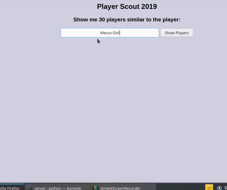

## Soccer Player recommendation system based on player's similarity

**Objective**: Finding similar players to a given player based on [cosine similarity](https://www.machinelearningplus.com/nlp/cosine-similarity/)

**Outline of the project** - 
1. Convert the player features to standardised vectors. Player features are based on [FIFA 19 dataset](https://www.kaggle.com/karangadiya/fifa19)
2. Find out the similarity or the cosine angle between the two vectors (of players), smaller the angle more is the similarity. The cosine similarity formula between two vectors is shown below: 

where A and B are the two vectors of nth dimension.

3. Based on the similarity scores, output the top 30 players

[Run the notebook on Google Colaboratory](https://colab.research.google.com/github/kavyajeetbora/player_scout_2019/blob/master/data/Similar_players.ipynb)
