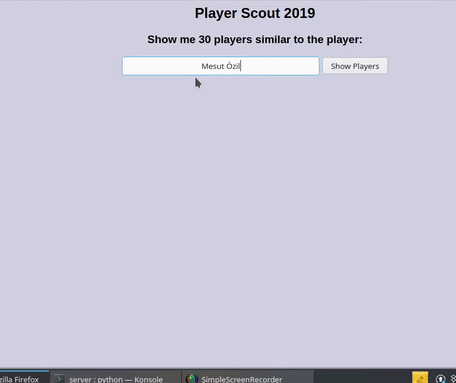

## Player Scout 2019
Finding similar player for a given player based on [cosine similarity](https://www.machinelearningplus.com/nlp/cosine-similarity/)

The project is based on the [FIFA 19 dataset](https://www.kaggle.com/karangadiya/fifa19)

**Idea of the project** - 
- convert the player features to standardised vectors 
- then find out the similarity or the cosine angle between the two vectors (of players), smaller the angle more is the similarity. The cosine similarity formula between two vectors is shown below: 

where A and B are the two vectors of nth dimension. 

- output the top 30 players as show below:

